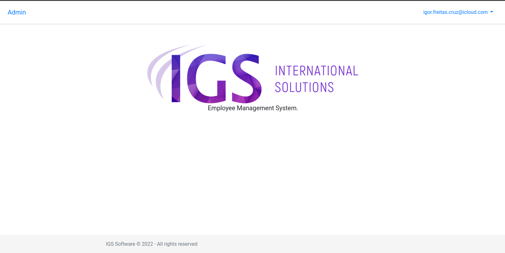
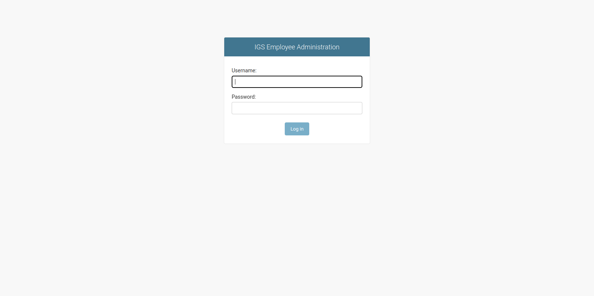
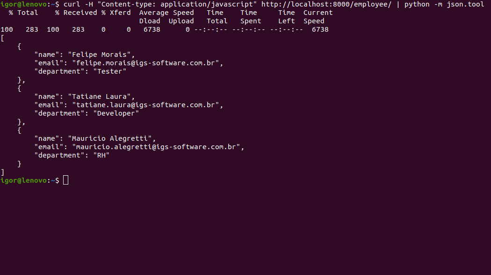

<!-- Title -->

<h1 align="center">
   IGS-Software Manager
</h1>

<!-- Description -->

<h3 align="center">
   Employee Management System
</h3>

<br>

<!-- Table of content -->

Table of contents
=================
- [About the project](#about-the-project)
- [Functionalities](#️functionalities)
- [Running the project](#running-the-project)
   - [Docker](#docker)
- [Admin](#admin-panel)
- [API example](#api-example)
- [Technologies](#technologies)
- [Author](#author)

---

## 💻 About the project

This project is about the creation of an application plataform Interface (API) to manage employee information, such as name, e-mail and department for the IGS team.

<p align="center">
   
</p>

---

## Functionalities

- [x] Django Admin panel to manage employees` data
- [x] A Django API to list, add and remove employees.
- [x] MongoDB for data storage

---

## Running the project

```bash
# Clone this repository
$ git clone https://github.com/IgorFreitasCruz/django-api.git

# Access the project folder 
$ cd django-api
```

---

### Docker

```bash
# run the container
$ docker-compose up -d

# create a superuser to access the admin panel
$ docker-compose run web python manage.py createsuperuser
```

---

## Admin panel

To access the Django Admin panel go to ```http://localhost:8000/admin``` or click the **Admin** button in the home page.

<p align="center">
   
</p>

---

### API example
To print formatted json text add `| python -m json.tool` to the curl command

```bash
$ curl -H "Content-Type: application/javascript" http://localhost:8000/employee/
```

<p align="center">
   
</p>

---

## Technologies

The following tools were used in the project:

-   **[Django](https://www.djangoproject.com/)**
-   **[Docker](https://www.docker.com/)**
-   **[MongoDB](https://www.mongodb.com/)**

---

## Author
<a>
 
 <br />
 <sub><b>Igor de Freitas Cruz</b></sub></a> 🚀
 <br />

[](https://www.linkedin.com/in/igorfreitascruz/)
[](mailto:igor.freitas.cruz@icloud.com)

---

Made with ❤️ by Igor Cruz 👋🏻 [Contact me!](https://www.linkedin.com/in/igorfreitascruz/)
